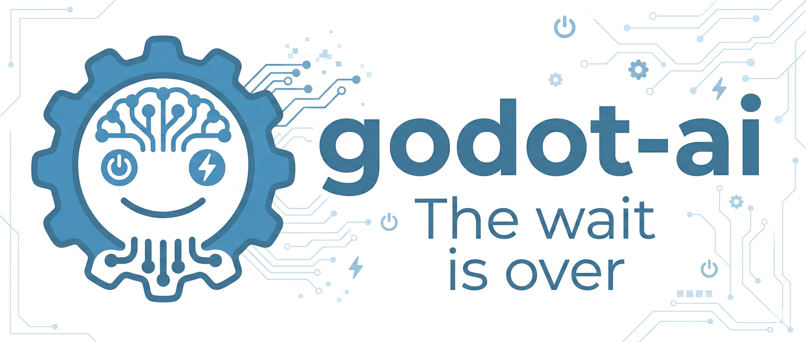

<p align="center">
  
</p>

# Godot AI

[](https://github.com/hi-godot/godot-ai/actions/workflows/ci.yml)
[](https://codecov.io/gh/hi-godot/godot-ai)

Connect MCP clients directly to a live Godot editor.

Godot AI exposes the Godot editor over MCP so tools like Claude Code and other HTTP-capable MCP clients can inspect scenes, search project data, create nodes, run tests, and read structured editor resources from a real project.

> **Status:** early, usable, and still expanding. The current build already supports scene and project inspection, node creation, in-editor test execution, multi-session routing, client configuration, and MCP resources.

*This is an independent community project, not affiliated with or endorsed by the [Godot Foundation](https://godot.foundation). Godot Engine is a free and open-source project under the [MIT license](https://godotengine.org/license).*

## What It Does

- Bridges a running Godot editor to MCP over HTTP.
- Exposes editor state, scene data, selection, project settings, logs, and sessions as tools and resources.
- Lets an MCP client create nodes and inspect the project without custom per-client glue.
- Runs GDScript test suites inside the connected editor and returns structured results.
- Supports multiple connected Godot sessions with explicit active-session routing.

## Quick Start

### Prerequisites

- Godot `4.3+` (`4.4+` recommended)
- [uv](https://docs.astral.sh/uv/) for user installs
- An MCP client that can connect to an HTTP MCP server

### 1. Install the plugin

Copy `plugin/addons/godot_ai/` into your Godot project's `addons/` folder.

### 2. Enable the plugin

In Godot, open **Project > Project Settings > Plugins** and enable **Godot AI**.

When enabled, the plugin will:

- start or reuse the shared MCP server
- connect the editor to the server over WebSocket
- show connection state, client configuration, and logs in the Godot AI dock

The launcher checks for a local development checkout first, then falls back to `uvx`, then a system `godot-ai` install.

### 3. Connect an MCP client

The dock includes **Configure** buttons for supported clients:

- `Claude Code`
- `Codex`
- `Antigravity`

For other clients, point them at:

```text
http://127.0.0.1:8000/mcp
```

<details>
<summary><strong>Manual client configuration examples</strong></summary>

**Claude Code**

```bash
claude mcp add --scope user --transport http godot-ai http://127.0.0.1:8000/mcp
```

**Codex** (`~/.codex/config.toml`)

```toml
[mcp_servers."godot-ai"]
url = "http://127.0.0.1:8000/mcp"
enabled = true
```

**Antigravity** (`~/.gemini/antigravity/mcp_config.json`)

```json
{
  "mcpServers": {
    "godot-ai": {
      "serverUrl": "http://127.0.0.1:8000/mcp",
      "disabled": false
    }
  }
}
```
</details>

### 4. Try a few prompts

- `Show me the current scene hierarchy.`
- `What nodes are currently selected in the editor?`
- `Create a Camera3D named MainCamera under /Main.`
- `Search the project for PackedScene files in ui/.`
- `Run the scene test suite.`

## Capabilities

### Sessions and Editor

| Tool | Description |
|------|-------------|
| `session_list` | List connected Godot editor sessions |
| `session_activate` | Set the active session for multi-editor routing |
| `editor_state` | Read Godot version, project name, current scene, and play state |
| `editor_selection_get` | Read the current editor selection |
| `logs_read` | Read recent MCP log lines from the editor |
| `reload_plugin` | Reload the Godot editor plugin and wait for reconnect |

### Scene and Node Workflows

| Tool | Description |
|------|-------------|
| `scene_get_hierarchy` | Read the scene tree with pagination support |
| `scene_get_roots` | List open scenes in the editor |
| `node_create` | Create a node by type with optional name and parent path |
| `node_find` | Search nodes by name, type, or group |
| `node_get_properties` | Read all properties for a node |
| `node_get_children` | Read direct children for a node |
| `node_get_groups` | Read group membership for a node |

### Project and Test Workflows

| Tool | Description |
|------|-------------|
| `project_settings_get` | Read a Godot project setting by key |
| `filesystem_search` | Search project files by name, type, or path |
| `run_tests` | Run GDScript test suites inside the editor |
| `get_test_results` | Read the most recent test results without rerunning |

### Client Setup

| Tool | Description |
|------|-------------|
| `client_configure` | Configure a supported MCP client from the editor |
| `client_status` | Check which supported clients are configured |

## Resources

Godot AI also exposes structured MCP resources for clients that prefer reading state directly.

| Resource URI | Description |
|-------------|-------------|
| `godot://sessions` | Connected editor sessions with metadata |
| `godot://scene/current` | Current scene path, project name, and play state |
| `godot://scene/hierarchy` | Full scene hierarchy from the active editor |
| `godot://selection/current` | Current editor selection |
| `godot://project/info` | Active project metadata |
| `godot://project/settings` | Common project settings subset |
| `godot://logs/recent` | Recent editor log lines |

## Default Ports

| Port | Purpose |
|------|---------|
| `9500` | WebSocket link between Godot and the Python server |
| `8000` | HTTP MCP endpoint for clients (`/mcp`) |

## How It Works

```text
MCP Client
   | HTTP MCP
   v
Python Server (FastMCP)
   | WebSocket
   v
Godot Editor Plugin
   | EditorInterface + SceneTree APIs
   v
Godot Editor
```

The Godot plugin is the bridge to the live editor. It starts or reuses the Python server, connects over WebSocket, and exposes editor capabilities as MCP tools and resources over HTTP.

## Development

```bash
# Create the local dev environment
script/setup-dev

# Activate the environment
source .venv/bin/activate

# Run Python tests
pytest -v

# Lint
ruff check src/ tests/

# Start the MCP server manually in dev mode
python -m godot_ai --transport streamable-http --port 8000 --reload
```

For Godot-side coverage, use the `run_tests` MCP tool against the sample project or a connected editor session.

## Contributing

- Work on feature branches off `main`.
- Keep Python tests and lint clean before opening a PR.
- Add tests for new behavior where practical, including Godot-side tests when the change crosses the plugin boundary.

```bash
git checkout -b feature/my-feature
source .venv/bin/activate
pytest -v
ruff check src/ tests/
git push -u origin feature/my-feature
gh pr create
```

## Visual Roadmap

The current README is still light on visuals. A prioritized asset punch list lives in [docs/readme-visual-punchlist.md](docs/readme-visual-punchlist.md).

## License

A repository license file has not been added yet.
